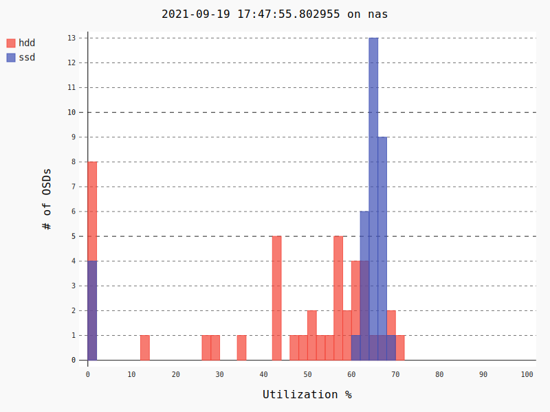

# ceph-osd-utilization-graph

Create an SVG histogram that shows Ceph OSD utilization statistics:


A well balanced Ceph cluster shows a narrow spike, while an imbalanced one
shows a wide gauss curve. Added OSDs start from the left (0% utilization)
and slowly merge into the main curve as the system balances.

Thanks to Tom Byrne for the graph idea. See his great presentation at https://www.youtube.com/watch?v=niFNZN5EKvE

Usage:
```
python3 -m venv _venv && _venv/bin/pip install -r requirements.txt
ceph osd df -f json | _venv/bin/python osd-usage-histogram.py > output.svg
```

Released under the MIT License
(c) 2021 by Jarno Elonen
